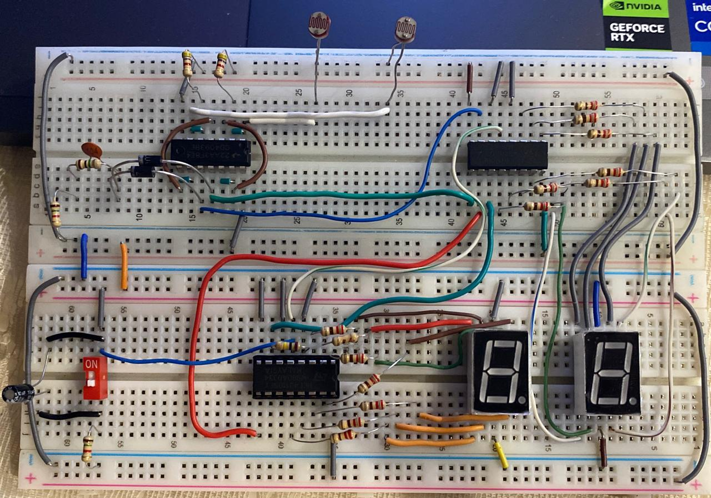
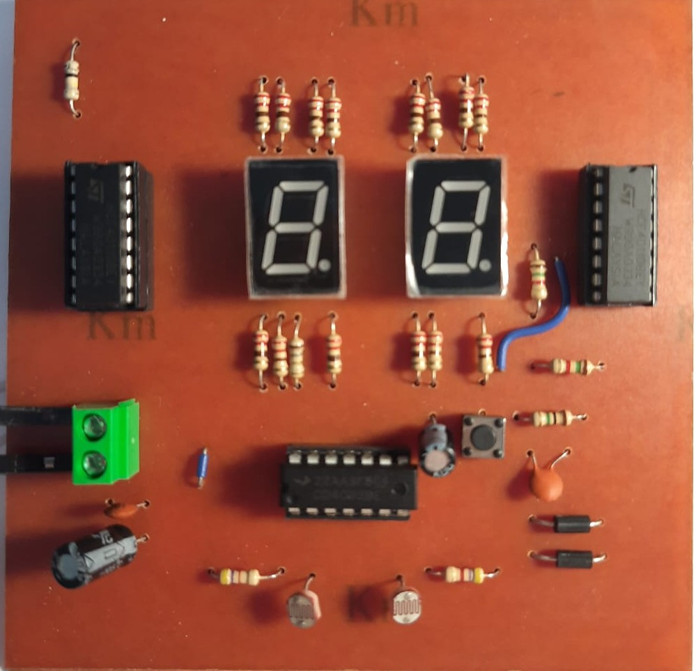

# Bi-Directional Digital Visitor Counter (Non-Microcontroller Based)

An automated, purely hardware-based digital visitor counting system designed to monitor room occupancy in real-time. This project was developed as a university engineering assignment at **Helwan University, Faculty of Engineering**.

The core highlight of this system is that it achieves fully bi-directional entry and exit counting **without utilizing a microcontroller or any software programming**, relying entirely on standard CMOS digital integrated circuits (ICs) and optical sensors[cite: 1].

---

## 📸 System Previews

### Hardware Implementation (Breadboard vs. Final Custom PCB)
| Prototype on Testboard | Final Soldered PCB Hardware |
|---|---|
|  |  |

## 🛠️ Project Objective & Key Specifications

* **Bi-Directional Detection:** Identifies the direction of a visitor's movement (Entry vs. Exit) using sequential beam interruption[cite: 1].
* **Real-Time Display:** Keeps an accurate real-time room occupancy count from `00` to `99` displayed on two 7-segment displays[cite: 1].
* **Pure Hardware Debouncing:** Employs Schmitt Trigger gates to condition analog sensor outputs into clean digital signals[cite: 1].
* **Direct Display Driving:** Utilizes specialized counters that natively drive common-cathode 7-segment displays, optimizing component count[cite: 1].

---

## 📐 System Circuit Diagram & Simulation

The circuit functionality was fully validated using **Proteus Simulation software** across all operational test cases prior to hardware fabrication[cite: 1].

### Core System Circuit Stages:

1. **Sensing Stage:** Two Light Dependent Resistors ($LDR_1$ and $LDR_2$) form voltage dividers[cite: 1]. When a light beam is unblocked, the sensor resistance is low, providing a digital `LOW` input to the stage[cite: 1]. When blocked by a human body, resistance spikes to several mega-ohms, outputting a sharp digital `HIGH` pulse[cite: 1].
2. **Signal Conditioning & Debouncing:** **CD4093 Schmitt Trigger NAND gates** act as inverting buffers to filter high-frequency noise and output clean falling edges[cite: 1].
3. **Direction Detection Logic:** Cross-connected logic gates decode the sensor interruption sequence[cite: 1]:
   * $LDR_2$ blocked first $\rightarrow$ $LDR_1$ blocked $\rightarrow$ **Entering** (Generates count-up pulse)[cite: 1].
   * $LDR_1$ blocked first $\rightarrow$ $LDR_2$ blocked $\rightarrow$ **Exiting** (Generates count-down pulse)[cite: 1].
4. **Counting & Cascading:** Two **CD40110 Decade Up/Down Counter ICs** are cascaded together[cite: 1]. The `CARRY` pin of the units counter clocks the count-up pin of the tens counter, while the `BORROW` pin handles the count-down clocking[cite: 1].

---

## 🎛️ Component Bill of Materials (BOM)

| Component Class | Component Name / Description | Quantity |
| :--- | :--- | :--- |
| **Integrated Circuits** | CD4093 Schmitt Trigger NAND Gate | 1 |
| | CD40110 Up/Down Counter & 7-Seg Decoder | 2 |
| **Sensors** | Light Dependent Resistors (LDR) | 2 |
| **Displays** | 7-Segment Display (Common Cathode) | 2 |
| **Diodes** | 1N4007 Steering Diodes | 2 |
| **Passive Elements** | Resistors: $4.7\text{ k}\Omega$, $220\ \Omega$, $1.5\text{ k}\Omega$, $1\text{ M}\Omega$, $100\text{ k}\Omega$ | As specified in report |
| | Capacitors: $220\mu\text{F}$, $10\mu\text{F}$, $100\text{nF}$ | As specified in report |
| **Power Supply** | 9V Battery / DC Power Supply Node | 1 |

---

## 🚀 Future Scope Improvements

* Replace the standard LDR sensors with Modulated Infrared (IR) transmitter-receiver pairs to dramatically increase stability under varying ambient indoor light environments[cite: 1].
* Integrate a buzzer alarm sub-circuit to trigger an alert if room capacity cross-limits are reached[cite: 1].
* Interface the digital pulse lines out of the logic stage to a microcontroller framework (e.g., Arduino) to provide network cloud data logging[cite: 1].

---

## 👥 Project Team & Credits

* **Academic Supervisor:** Dr. Salwa El-Sabban[cite: 1]
* **Project Concept & Idea:** Mayar Walid[cite: 1]
* **Breadboard Prototyping:** Farah Ayman[cite: 1]
* **Proteus Simulation:** Aly Hamdy[cite: 1]
* **PCB Layout Design:** Nermeen Ayman[cite: 1]
* **Hardware Assembly & Soldering:** Karim Yasser[cite: 1]
* **Documentation & Technical Report:** Completed Collaboratively by All Members[cite: 1]
